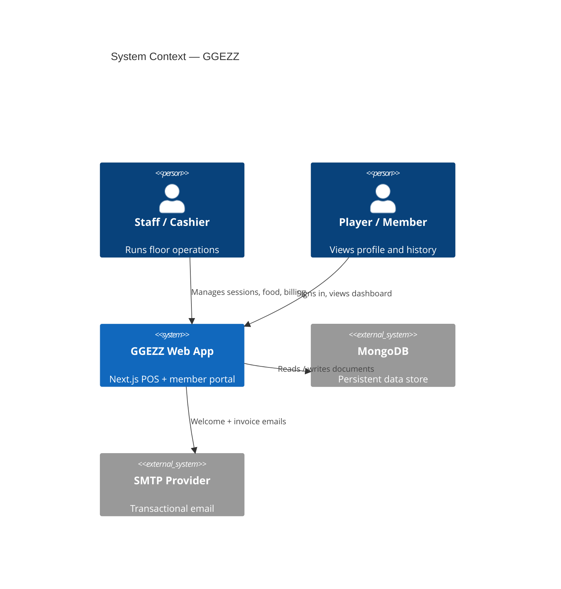
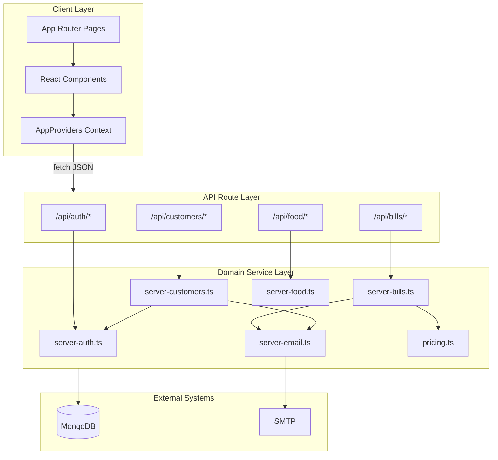
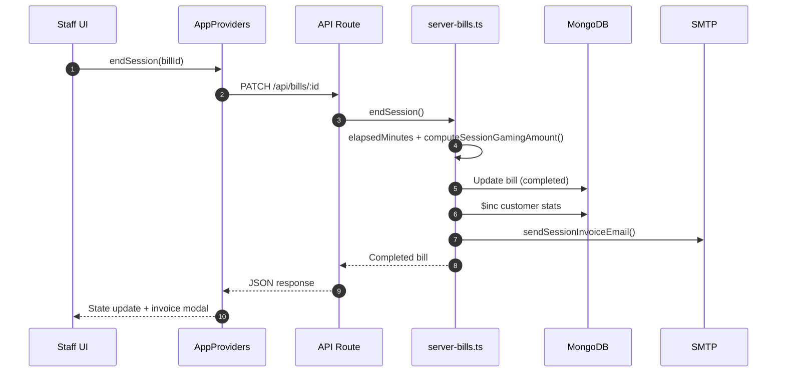
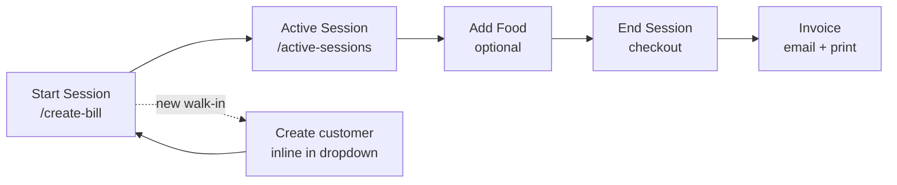
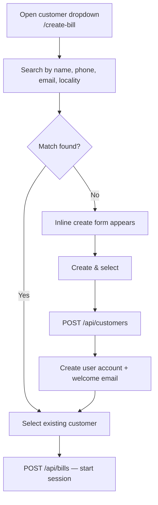
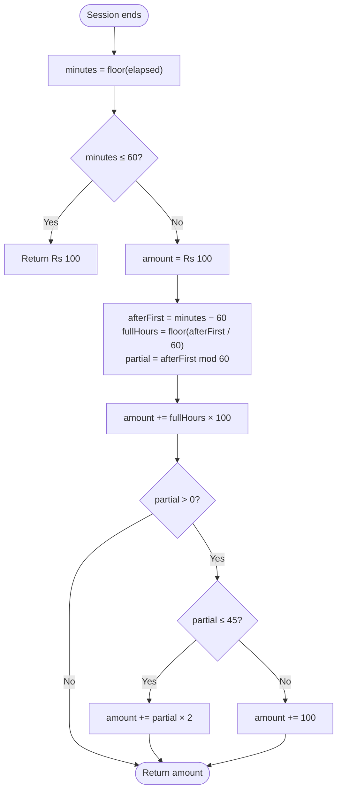
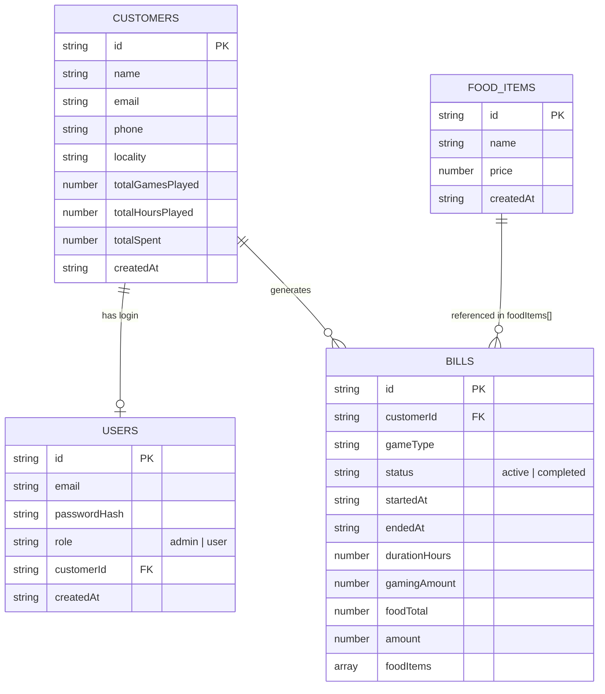

# GGEZZ Gaming Cafe Management System

A full-stack Point-of-Sale (POS) and operations platform for gaming lounges, PC bangs, and console arenas. GGEZZ combines real-time session tracking, tiered gaming billing, integrated cafe orders, member dashboards, and automated invoicing in a single Next.js application.

---

## Table of Contents

1. [Overview](#overview)
2. [System Context](#system-context)
3. [Architecture](#architecture)
4. [Application Workflows](#application-workflows)
5. [Gaming Pricing Engine](#gaming-pricing-engine)
6. [Project Structure](#project-structure)
7. [Data Model](#data-model)
8. [API Reference](#api-reference)
9. [Security](#security)
10. [Setup & Deployment](#setup--deployment)
11. [Technical Notes](#technical-notes)

---

## Overview

### Problem Statement

| Challenge | GGEZZ Solution |
|-----------|----------------|
| Manual session timing causes revenue leakage | Millisecond-accurate timers with deterministic checkout pricing |
| Gaming and cafe tabs are billed separately | Single consolidated invoice per session |
| Walk-in registration slows the counter | Inline customer creation during session start |
| Players lose visibility after checkout | Member portal with stats, history, and invoices |
| Peak-hour checkout bottlenecks | One-click end session, email receipt, and browser print |

### Personas

| Role | Primary surfaces | Capabilities |
|------|------------------|--------------|
| **Staff / Admin** | `/dashboard`, `/create-bill`, `/active-sessions` | Start sessions, create customers inline, add food, checkout, analytics |
| **Player / Member** | `/my-profile` | View play history, spending, station usage, invoices |
| **Public visitor** | `/` | Marketing site, pricing, login entry |

### Platform Support

All stations share the same pricing rules: **PS2**, **PS3**, **PS4**, **PS5**, and **PC / System**.

---

## System Context



---

## Architecture

### Layered Design

GGEZZ follows a **layered service-oriented architecture** inside the Next.js App Router. UI components never talk to MongoDB directly; all mutations flow through API routes into domain services.



### Request Lifecycle



### Architectural Decisions

| Decision | Rationale | Location |
|----------|-----------|----------|
| **React Context as client store** | Single in-memory source of truth; refetch-on-mutation keeps UI in sync | `src/components/providers/app-providers.tsx` |
| **Role-based layout gates** | `(staff)` and `(player)` route groups enforce access before rendering shells | `staff-gate.tsx`, `user-gate.tsx` |
| **Mongo connection singleton** | Prevents duplicate connections during Next.js Fast Refresh | `src/lib/mongodb.ts` |
| **Pricing in pure functions** | Billing rules are testable, isolated, and reused at checkout | `src/lib/pricing.ts` |
| **Inline customer creation** | Reduces counter steps for walk-ins; no separate onboarding form | `customer-search.tsx` + `/create-bill` |
| **Hidden iframe printing** | Prints receipt without navigation or popup blockers | `src/lib/invoice-print.ts` |
| **Incremental stat aggregation** | Customer totals updated via `$inc` at checkout, not full re-scan | `server-customers.ts` |

---

## Application Workflows

### End-to-End Session Flow



### 1. Customer Registration (Inline at Session Start)

Customer profiles are **no longer created on a separate form**. Staff register walk-ins directly from the **Start session** page.



**Steps**

1. Staff opens `/create-bill` and searches the customer dropdown.
2. If no match, the inline form opens (auto-prefilled from search text when possible).
3. `POST /api/customers` creates the profile, user credentials, and sends a welcome email.
4. The new customer is auto-selected; staff picks a station and starts the session.

The `/customers` page is now **read/manage only** (browse, view stats, delete). New profiles are created from Start session.

### 2. Active Session Management

| Step | Route | Action |
|------|-------|--------|
| Monitor | `/active-sessions` | Live timers, food totals, end-session controls |
| Add food | Session card | `POST /api/bills/[id]/food` |
| End | Session card | `PATCH /api/bills/[id]` → pricing, stats, email, invoice |

**Constraints**

- One active session per customer at a time.
- Food can only be appended to `status: "active"` bills.

### 3. Checkout & Invoicing

On `PATCH /api/bills/[id]`:

1. `elapsedMinutes(startedAt, endedAt)` — whole-minute duration.
2. `computeSessionGamingAmount()` — tiered gaming charge (see below).
3. Food subtotal added → final `amount`.
4. Customer stats incremented (`totalGamesPlayed`, `totalHoursPlayed`, `totalSpent`).
5. Invoice email dispatched via Nodemailer.
6. Staff prints receipt via hidden iframe (`invoice-print.ts`).

---

## Gaming Pricing Engine

Implementation: [`src/lib/pricing.ts`](src/lib/pricing.ts)

### Rules

| Duration segment | Charge |
|------------------|--------|
| First hour (or any session ≤ 60 min) | **Rs 100** minimum |
| Each additional **complete** hour | **+ Rs 100** |
| Leftover minutes after full hours (mid-hour exit) | **Rs 2/min** for 1–45 min |
| Leftover minutes **> 45 min** | **+ Rs 100** (counts as another full hour) |

Billing uses **floored whole minutes** from session timestamps — not rounded decimal hours.

### Pricing Decision Flow



### Worked Examples

| Session duration | Breakdown | Total |
|------------------|-------------|-------|
| 30 min | Min charge | **Rs 100** |
| 1 hr | Min charge | **Rs 100** |
| 1 hr 30 min | 100 + (30 × 2) | **Rs 160** |
| 1 hr 40 min | 100 + (40 × 2) | **Rs 180** |
| 1 hr 50 min | 100 + 100 *(50 min > 45)* | **Rs 200** |
| 2 hr | 100 + 100 | **Rs 200** |
| 3 hr | 100 + 200 | **Rs 300** |
| 3 hr 38 min | 100 + 200 + (38 × 2) | **Rs 376** |

### Reference Implementation

```typescript
export function computeGamingAmount(totalMinutes: number): number {
  const minutes = Math.max(0, Math.floor(totalMinutes));
  if (minutes <= 0) return 0;
  if (minutes <= 60) return 100;

  let amount = 100;
  const afterFirstHour = minutes - 60;
  const fullHours = Math.floor(afterFirstHour / 60);
  const partialMinutes = afterFirstHour % 60;

  amount += fullHours * 100;

  if (partialMinutes > 0) {
    amount += partialMinutes <= 45
      ? partialMinutes * 2
      : 100;
  }

  return Math.round(amount * 100) / 100;
}
```

Checkout calls `computeSessionGamingAmount(startedAt, endedAt)` in [`server-bills.ts`](src/lib/server-bills.ts).

---

## Project Structure

```
ggec/
├── public/                         # Static assets (logo, icons)
├── src/
│   ├── app/
│   │   ├── (player)/               # Member routes (UserGate)
│   │   │   └── my-profile/
│   │   ├── (staff)/                # Admin routes (AdminGate)
│   │   │   ├── active-sessions/    # Live floor panel
│   │   │   ├── create-bill/        # Start session + inline customer create
│   │   │   ├── customers/          # Browse / delete profiles
│   │   │   ├── dashboard/          # Analytics
│   │   │   └── food/               # Menu CRUD
│   │   ├── api/                    # REST route handlers
│   │   │   ├── auth/
│   │   │   ├── bills/
│   │   │   ├── customers/
│   │   │   └── food/
│   │   ├── globals.css
│   │   ├── layout.tsx
│   │   └── page.tsx                # Public marketing site
│   ├── components/
│   │   ├── brand/
│   │   ├── customer/
│   │   ├── marketing/
│   │   ├── player/
│   │   ├── providers/              # AppProviders global state
│   │   ├── staff/                    # Session UI, customer-search, invoices
│   │   └── ui/
│   └── lib/                        # Domain logic & utilities
│       ├── pricing.ts              # Billing engine
│       ├── server-bills.ts         # Session lifecycle
│       ├── server-customers.ts
│       ├── server-auth.ts
│       ├── server-email.ts
│       ├── server-food.ts
│       ├── mongodb.ts
│       └── types.ts
├── .env.example
├── next.config.ts
├── package.json
└── tsconfig.json
```

### Key Modules

| Module | Responsibility |
|--------|----------------|
| [`app-providers.tsx`](src/components/providers/app-providers.tsx) | Client state, auth persistence, API orchestration |
| [`customer-search.tsx`](src/components/staff/customer-search.tsx) | Searchable dropdown + inline `CustomerCreateForm` |
| [`server-bills.ts`](src/lib/server-bills.ts) | Session CRUD, food append, checkout pipeline |
| [`pricing.ts`](src/lib/pricing.ts) | Duration math and gaming charge computation |
| [`session-invoice.tsx`](src/components/staff/session-invoice.tsx) | Printable invoice UI |
| [`invoice-print.ts`](src/lib/invoice-print.ts) | Hidden iframe print pipeline |

---

## Data Model



### Collection Summary

| Collection | Purpose |
|------------|---------|
| `customers` | Player profiles and aggregated lifetime stats |
| `users` | Bcrypt-hashed credentials (`admin` or `user` role) |
| `bills` | Active and completed session records |
| `food_items` | Cafe menu catalog |

---

## API Reference

All endpoints return JSON. Base URL: `{APP_URL}/api`.

### Authentication

#### `POST /api/auth/login`

```json
{ "username": "admin@ggezz.com", "password": "your-secure-password" }
```

**200 OK**

```json
{
  "ok": true,
  "user": { "id": "uuid", "email": "admin@ggezz.com", "role": "admin" }
}
```

#### `POST /api/auth/change-password`

```json
{
  "email": "player@example.com",
  "currentPassword": "welcome1",
  "newPassword": "my-new-secure-password"
}
```

---

### Bills & Sessions

#### `GET /api/bills`

Returns all bills, newest first.

#### `POST /api/bills`

Start a session.

```json
{ "customerId": "customer-uuid", "gameType": "ps5" }
```

#### `PATCH /api/bills/[id]`

End session — runs pricing engine, updates stats, sends invoice email.

#### `POST /api/bills/[id]/food`

Append menu items to an active session.

```json
{ "foodIds": ["food-id-1", "food-id-2"] }
```

**Example completed bill** (1 hr 30 min + food):

```json
{
  "id": "bill-uuid",
  "customerId": "customer-uuid",
  "gameType": "ps5",
  "status": "completed",
  "startedAt": "2026-05-30T10:00:00.000Z",
  "endedAt": "2026-05-30T11:30:00.000Z",
  "durationHours": 1.5,
  "gamingAmount": 160.00,
  "foodTotal": 80.00,
  "amount": 240.00,
  "foodItems": [
    { "foodId": "food-uuid", "name": "Cold Drink", "unitPrice": 40, "quantity": 2 }
  ]
}
```

---

### Customers

#### `GET /api/customers`

List all profiles (sorted by name).

#### `POST /api/customers`

Create profile + user account + welcome email. Called from inline form on Start session.

```json
{
  "name": "Alex Mercer",
  "email": "alex@outlook.com",
  "phone": "9999111122",
  "locality": "Indiranagar",
  "password": "welcome1"
}
```

#### `DELETE /api/customers/[id]`

Delete profile (blocked if customer has an active session).

---

### Food Menu

| Method | Endpoint | Description |
|--------|----------|-------------|
| `GET` | `/api/food` | List menu items |
| `POST` | `/api/food` | Add item `{ "name", "price" }` |
| `DELETE` | `/api/food/[id]` | Remove item |

---

## Security

| Measure | Implementation |
|---------|----------------|
| Password storage | Bcrypt (10 rounds) via `bcryptjs` |
| Role enforcement | Layout gates + client-side session role checks |
| Injection prevention | Parameterized MongoDB driver filters |
| Email XSS | HTML escaping in `server-email.ts` templates |
| Secrets | Environment variables only (`.env`, never committed) |

---

## Setup & Deployment

### Prerequisites

- Node.js 18+
- MongoDB (local or Atlas)
- SMTP credentials (Gmail App Password, SendGrid, Mailtrap, etc.)

### Installation

```bash
git clone <repository-url>
cd ggec
npm install
```

### Environment Variables

Copy `.env.example` to `.env`:

```ini
MONGODB_URI=mongodb://127.0.0.1:27017/ggec
MONGODB_DB_NAME=ggec
APP_URL=http://localhost:3000

SEED_STAFF_EMAIL=admin@ggezz.com
SEED_STAFF_PASSWORD=change-me-promptly

DEFAULT_USER_PASSWORD=welcome1
NEXT_PUBLIC_DEFAULT_USER_PASSWORD=welcome1

SMTP_HOST=smtp.gmail.com
SMTP_PORT=587
SMTP_SECURE=false
SMTP_USER=your-email@gmail.com
SMTP_PASS=your-app-password
EMAIL_FROM="GGEZZ Gaming Cafe <noreply@gmail.com>"
```

### Run

```bash
npm run dev      # Development → http://localhost:3000
npm run build    # Production build
npm run start    # Production server
npm run lint     # ESLint
```

Admin account is seeded on first login using `SEED_STAFF_*` values.

---

## Technical Notes

### Tech Stack

| Layer | Technology |
|-------|------------|
| Framework | Next.js 16 (App Router) |
| UI | React 19, Tailwind CSS v4 |
| Language | TypeScript 5 |
| Database | MongoDB 7 (Node driver) |
| Email | Nodemailer 8 |
| PDF | PDFKit 0.18 *(implemented, not wired to routes)* |

### Known Technical Debt

| Item | Status |
|------|--------|
| `bills-storage.ts` | Unused localStorage utility |
| `invoice-pdf.ts` | PDFKit canvas implemented; no API route attached |
| Analytics | Full recompute on dashboard load; no pre-aggregated collections |
| Transactions | Checkout mutations not wrapped in MongoDB multi-document transactions |

### Print Pipeline

[`invoice-print.ts`](src/lib/invoice-print.ts) clones the invoice DOM into a hidden iframe, injects stylesheets, calls `contentWindow.print()`, and removes the iframe — avoiding full-page navigation during POS checkout.

---

## License

Private — All rights reserved.
